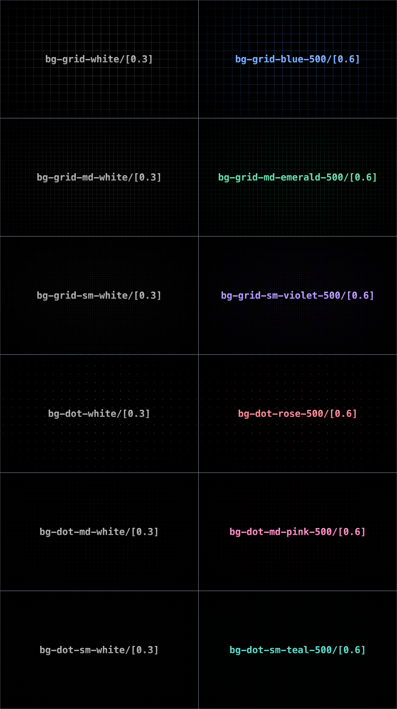

# Tailwind Grid

A simple Tailwind CSS plugin that adds grid & dot background patterns

<kbd>
  <div align="center">
    
  </div>
</kbd>

## Installation

```bash
npm install @bebeal/tailwind-grid --save-dev
```

## Usage

### Tailwind v3
Add the plugin to your Tailwind configuration:

```ts
// tailwind.config.ts
import type { Config } from 'tailwindcss'
import GridPlugin from '@bebeal/tailwind-grid'

export default {
  theme: {
    // ...
  },
  plugins: [
    GridPlugin,
  ],
} satisfies Config
```

### Tailwind v4
Use the `@plugin` directive in your css file:

```css
@plugin '@bebeal/tailwind-grid';
```

### Available Classes

- `bg-grid-{color}`
- `bg-grid-md-{color}`
- `bg-grid-sm-{color}`
- `bg-dot-{color}`
- `bg-dot-md-{color}`
- `bg-dot-sm-{color}`

You can style them like any other background (e.g. with color, opacity, etc.)

### Example

```tsx
<div className="h-[450px] bg-black bg-grid-white/[0.3] relative">
    <div className="absolute pointer-events-none inset-0 bg-black [mask-image:radial-gradient(ellipse_at_center,transparent_20%,black)]" />
</div>
```

## License

MIT
